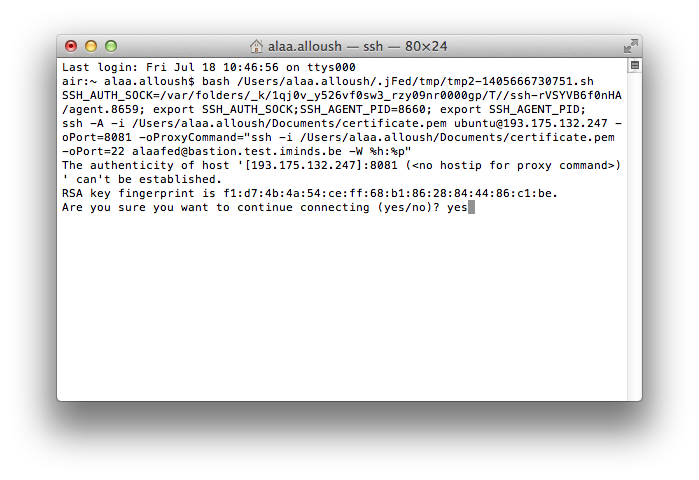
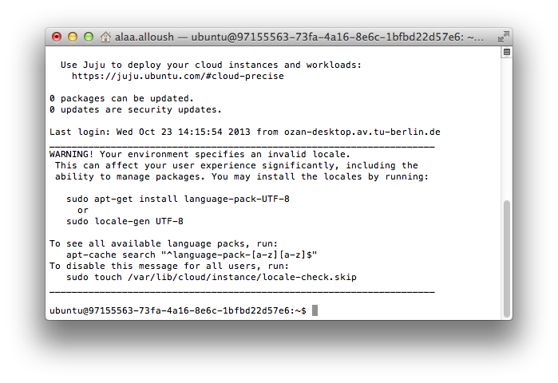
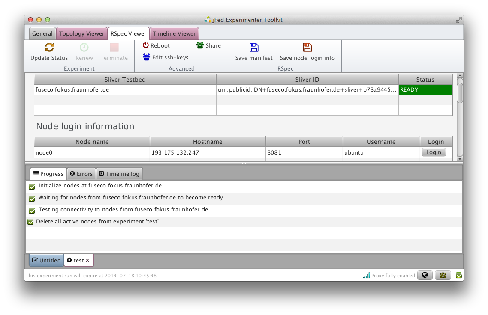

```````````````````````````````
Accessing the Nodes via SFA
```````````````````````````````

We assume that you've already valid access credentials (see :ref:`sfaaccess-label`).

.. contents:: Table of Contents


Status of the Testbed
=====================

Check https://flsmonitor.fed4fire.eu to see the status and number of free resources on the Fed4FIRE testbeds, including the FUSECO Playground. You can also check the capabilities of the testbeds also as explained in "Automated Scenario Tests".


Software Installation
=====================

Conceptionally, it should be possible to request resources using any SFA compliant tool.
One example is the `jFed Experimenter GUI <http://jfed.iminds.be>`_ (tested with release 1536) and we assume that you've
installed the binary and started it for example via command line::

   java -jar jFed-experimenter-GUI.jar

Software Configuration
======================

Depending on the used client, you might first need to configure the according testbed endpoints:

* SFA Aggregate Manager v3

  * URL: https://fuseco.fokus.fraunhofer.de/api/sfa/am/v3
  * URN: urn:publicid:IDN+fuseco.fokus.fraunhofer.de+authority+root

* SFA User and Slice API: 

  * URL: https://fuseco.fokus.fraunhofer.de/api/sfa/registry/v1
  * URN: urn:publicid:IDN+fuseco.fokus.fraunhofer.de+authority+cm
  

Getting Access to a Node
========================

In order to start jFed Experimenter, go to http://jfed.iminds.be 
You can start the tool either by clicking on Quickstart jFed experimenter tool or by downloading and starting jFed Experimenter GUI JAR file

After jFed starts, you need to choose the path of your certificate and enter the password 

  .. figure:: ../images/jfed_login.png

Click on New to start a new experiment.

  .. figure:: ../images/new_Experiment.png

Click on RSpec Editor tab.

  .. figure:: ../images/RSpec_Editor.png

Copy the example RSpec at the buttom of this page under "Resource Descriptions (RSpecs)", which is used to describe the resources required for the experiment.

Paste it to RSpec editor

  .. figure:: ../images/RSpec_Editor_withCode.png

Click on Run to start an experiment

Choose a slice name for the experiment, project name and the duration of the experiment. In this example the slice name is "test" and project name is "fgre". The duration of the experiment is 2 hours 

 .. figure:: ../images/Slice_name.png

Wait for access. It may take some time to start and initialise the resources. Click ok to complete

 .. figure:: ../images/initialize.png

After initialisation phase finishes, the requested node will become ready and the connectivity to the node will be tested.
If everything is going well, all mentioned steps will be green as you can see from the folloiwng picture

 .. figure:: ../images/READY.png

Press on Login button to log into the node
Type yes to continue



Now you logged into the node and it is ready for your configurations 



Click on Terminate after you finish your experiment to release the resources



You see from the previous picture that all active nodes are deleted from our experiment. 

Testing the API
===============

The automated scenario tests can be executed using the `jFed automated testing GUI <http://jfed.iminds.be>`_ (tested with release 1495). Install the binary and start it via command line::

   java -jar jFed-automated-testing-GUI.jar

After you start jFed testing GUI, select your certificate and type your password to login.

Select from the target authority dropdown list "fuseco.fokus.fraunhofer.de". This will identify the aggregate manager to be used. The slice manager will be selected automatically based on the certificate you have.

Select from "type of test" the "be.iminds.ilabt.jfed.lowlevel.api.test.TestAggregateManager3" to test against GENI Aggregate Manager API Version 3.

 .. figure:: ../images/jfedAutoTestingSelectTypeOfTest.png

Now you should configure the test environment. Click on "Test Arguments" to set additional test arguments. Here you should specify at least "fixed_rspec". This is needed first on allocate request and will be used also for further tests. An example for this rspec you can find at the buttom of this page under "Resource Descriptions (RSpecs)". With this example Rspec, the jFed automated testing GUI will basically create a virtual machine, log in to it and delete it finally. It will run the tests in automated scenario one by one and test the testbed by calling the methods defined within GENI Aggregate Manager API Version 3. 

 .. figure:: ../images/jfedAutoTestingTestArguments.png


Optionally, if you want to test accessability using another ssh key pair, you can add these also as extra arguments. To do so choose a file for  "fixed_ssh_public_key_file" and "fixed_ssh_private_key_file" by clicking the button next to these arguments. Afterwards type the password for the ssh private key into the textbox for the argument "fixed_ssh_private_key_password".

 .. figure:: ../images/jfedAutoTestingTestArgumentSSHKeys.png

Click on "Run Tests" and see the compatibility of the testbed for the automated scenario tests.


Resource Descriptions (RSpecs)
==============================

Depending on the result of the listResources call, it is possible to provision different resources.
This documentation gives you two simple examples:

Test Ubuntu Machine
------------------------
Request RSpec::

  <?xml version="1.0"?>
  <rspec type="request" generated="2014-07-11T10:20:39Z" xsi:schemaLocation="http://www.geni.net/resources/rspec/3 http://www.geni.net/resources/rspec/3/request.xsd " xmlns:client="http://www.protogeni.net/resources/rspec/ext/client/1" xmlns:xsi="http://www.w3.org/2001/XMLSchema-instance" xmlns="http://www.geni.net/resources/rspec/3">
    <node client_id="PC" component_manager_id="urn:publicid:IDN+fuseco.fokus.fraunhofer.de+authority+cm" component_id="urn:publicid:IDN+fuseco.fokus.fraunhofer.de+node+fOpenStack" exclusive="false">
      <sliver_type name="m1.tiny"><disk_image name="fed4fireNightlyTest"/>
      </sliver_type>
    </node>
  </rspec>


OpenEPC Client and Measurement Server
------------------------
Request RSpec::

  <?xml version="1.0"?>
  <rspec
    xmlns:client="http://www.protogeni.net/resources/rspec/ext/client/1"
    xmlns:xsi="http://www.w3.org/2001/XMLSchema-instance"
    xmlns="http://www.geni.net/resources/rspec/3"
    type="request"
    generated="2014-06-12T14:20:39Z"
    xsi:schemaLocation="http://www.geni.net/resources/rspec/3 http://www.geni.net/resources/rspec/3/request.xsd">
    <node client_id="epc_client"
          component_manager_id="urn:publicid:IDN+fuseco.fokus.fraunhofer.de+authority+cm"
          component_id="urn:publicid:IDN+fuseco.fokus.fraunhofer.de+node+epc_client"
          exclusive="false">
      <sliver_type name="raw-pc"/>
    </node>
    <node client_id="epc_measurement"
          component_manager_id="urn:publicid:IDN+fuseco.fokus.fraunhofer.de+authority+cm"
          component_id="urn:publicid:IDN+fuseco.fokus.fraunhofer.de+node+epc_measurement_server"
          exclusive="false">
      <sliver_type name="raw-pc"/>
    </node>
  </rspec>
