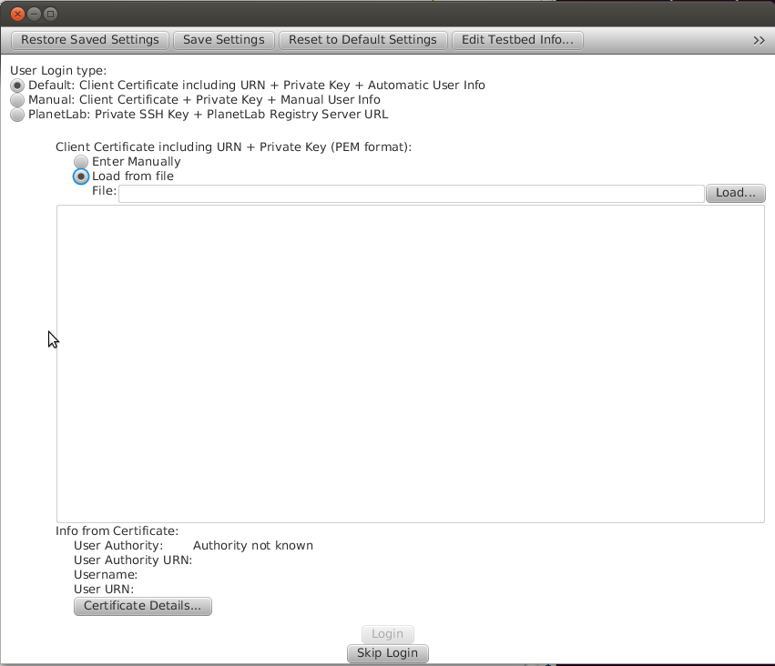

First, you'll see a login field and we assume that you don't have any credentials yet.

 
Configuring jFed
----------------

  1. Choose in Default Login type "Load from file" and load the previously created "mycredentials.pem".
  2. Type in your private key password.
  3. Choose "Edit Testbed Info.." -> "Add New by scanning AM URL..." and type in the following: (URL: https://fuseco.fokus.fraunhofer.de/api/sfa/am/v3 ; URN: urn:publicid:IDN+fuseco.fokus.fraunhofer.de+authority+cm) 

  .. figure:: ../images/jfed_config_fuseco_am.png
     :width: 40%

  4. Choose Scan and afterwards "Open scan result as new Authority".
  5. Close the testbeds info window again and click on "Login".
  6. Get Credentials: 

.. todo:: credentials

Accessing the Openstack via SFA using JFed
------------------------------------------

*Get Version

To get information about the aggregate manager you can call the getVersion method (Geni Aggregate Manager v3).

*Get Credential

To call the further methods like listResources etc. you will need credentials for these calls. To get the credentials call the getCredential method (ProtoGeni Slice Authority API v1).

*List Resources

To list all resources, call the listResources method (Geni Aggregate Manager v3). JFed sets the credential retrieved in getCredential method automatically as parameter. The response contains the list of resources. The node related with openstack has the attribute component_id="urn:publicid:IDN+localhost+node+fOpenStack". In this node the "sliver_type"s listed with possible "disk_image"s. You can select from this list the sliver_type and the disk_image and create a request to allocate and later provision it.

*Register

You need to create a slice before you allocate and provision the slivers in it. To do so call the register method (ProtoGeni Slice Authority API v1). For this call the parameter "slice" must be set 
(e. g. "urn:publicid:IDN+wall2.ilabt.iminds.be+slice+<name>" must be changed to "urn:publicid:IDN+wall2.ilabt.iminds.be+slice+something"). This call creates a slice with name "<name>". Slice name must be unique, trying to create 2 slices with same name is not possible.

*Allocate

To allocate a sliver in the created slice call the allocate method (Geni Aggregate Manager v3). If it is not automatically set in JFed, you should set the correct "sliceUrn", which you have created calling the register method.  You can define what you want to allocate in this slice in "rspec" parameter. To create a "request RSpec" you should select the "sliver_type" and the "disk_image" from the response of the listResources method. An example RSpec can look like:

<rspec type="request" generated="2014-06-13T14:20:39Z" xsi:schemaLocation="http://www.geni.net/resources/rspec/3 http://www.geni.net/resources/rspec/3/request.xsd " xmlns:client="http://www.protogeni.net/resources/rspec/ext/client/1" xmlns:xsi="http://www.w3.org/2001/XMLSchema-instance" xmlns="http://www.geni.net/resources/rspec/3">
  <node client_id="PC" component_manager_id="urn:publicid:IDN+wall2.ilabt.iminds.be+authority+cm" component_id="urn:publicid:IDN+localhost+node+fOpenStack" exclusive="true">
    <sliver_type name="m1.tiny"><disk_image name="zabbix-server-mysql-v1"/>
    </sliver_type>
  </node>
</rspec>

*Provision

To configure your sliver call the provision method (Geni Aggregate Manager v3). Set the slice urn again if it is not set correctly. "users" parameter allows to set the user, who can have access on this virtual machine. So please set here the SSH key and user urn. In the response you will get the IP where you can have access to your machine with user name "ubuntu" and over the port 8081. Here is an example response of a successfull configuration:

TODO: the RSpec manifest, which contains the IP.

*Delete

If your experiment is finished you can call delete method (Geni Aggregate Manager v3), to release the resources you allocated.

